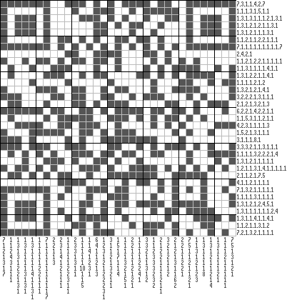

<link rel='stylesheet' href='markdown8.css'/>

VolgaCTF Quals 2014 Writeups
============================

Joy 200
-------

Japcross.txt resembles a picross/nonogram puzzle. It's a bit large to solve by hand, so we wrote a script to reformat it:

	rows = open('japcross.txt').read().split('\r\n')

	def get(x,y):
		return rows[y].split('\t')[x]

	ver = []
	hor = []
	for y in range(11,44):
		vals = []
		for x in range(11,-1,-1):
			r = get(x,y)
			if not r: break
			vals = [r] + vals
		ver.append(vals)

	for x in range(12,45):
		vals = []
		for y in range(10,-1,-1):
			r = get(x,y)
			if not r: break
			vals = [r] + vals
		hor.append(vals)

	print "width", len(hor)
	print "height", len(ver)
	print
	print "rows"
	for row in ver:
		print ','.join(row)
	print
	print "columns"
	for col in hor:
		print ','.join(col)

Then, we submitted it to an online solver [here](http://www.comp.lancs.ac.uk/~ss/nonogram/auto):

The QR code encodes "longing for you drove me through the stars. Alexei Tolstoy". This entire string was the flag.

Joy 300
-------

CTFy Rocket is a Flappy Bird clone apparently developed in Borland Delphi. The stated goal in the challenge description is to reach the 42nd "parsec". 

In TForm1_Timer1Timer we find the code that checks for collisions and travel out of bounds. By debugging the game and setting breakpoints, we find that there are two large conditional blocks responsible for collision checking:

	if ( *(_DWORD *)(v8 + 68) < *(_DWORD *)(v9 + 68) + 600
	< more expressions >
	&& *(_DWORD *)(*(_DWORD *)(v2 + 760) + 64) < *(_DWORD *)(*(_DWORD *)(v2 + 788) + 64) + 100 )
	dword_45CE14 = 572;

	if ( *(_DWORD *)(v13 + 68) < *(_DWORD *)(v14 + 68) + 600
	< more expressions >
	&& *(_DWORD *)(*(_DWORD *)(v2 + 760) + 64) < *(_DWORD *)(*(_DWORD *)(v2 + 788) + 64) + 100 )
	dword_45CE14 = 1323;

Then, `dword_45CE14` is later compared to 572. If greater than or equal, the game ends:

	if ( dword_45CE14 >= 572 )
	  {
	    Controls__TControl__SetVisible(*(_DWORD *)(v2 + 760), 0);
	    unknown_libname_442(*(_DWORD *)(v2 + 792), 0);
	    LOBYTE(v11) = 1;
	    Controls__TControl__SetVisible(*(_DWORD *)(v2 + 808), v11);
	    LOBYTE(v12) = 1;
	    Controls__TControl__SetVisible(*(_DWORD *)(v2 + 840), v12);
	    Controls__TControl__SetLeft(*(_DWORD *)(v2 + 808), *(_DWORD *)(*(_DWORD *)(v2 + 760) + 64));
	    Controls__TControl__SetTop(*(_DWORD *)(v2 + 808), *(_DWORD *)(*(_DWORD *)(v2 + 760) + 68));
	  }

On several occasions, the text of a hidden caption is manipulated in a function that didn't appear fun to reverse:

	Controls__TControl__GetText(*(_DWORD *)(v2 + 816), &v27);
	sub_4581B4(v27, v7, &v29);
	Controls__TControl__SetText(*(_DWORD *)(v2 + 816), v29);

The number of times this occurred also proved difficult to calculate, so we focused on removing collision checks instead.

After the game began, we patched the binary to set `dword_45CE14` to 256 each time a collision occured. Then, we were able to fly through the level ignoring obstacles. Once we reached the 42nd parsec, the hidden caption was revealed and it contained our flag.

Crypto 100
----------

Initially, this challenge was very difficult. Though the encoding function was easy to analyze and reimplement, decoding the provided plaintext required some algorithmic skill. Here is the original encoding function:

	def encode(s):
		n = 1
		i = 0
		for c in s:
			if c not in string.letters: break
			c = ord(c.upper())-ord('A')
			n *= pow(primes[c],primes[i])
			i += 1
		return n

Note that any character that is not a character between A-Z is ignored, along with the rest of the string. This behavior matches what we observed from the service on port 28121. A hint was later provided: "the plaintext we encrypted using the oracle is a single meaningful word." Having reproduced the encoding function, I tried encoding each of 60 million words appearing in the English Wikipedia, but found no matches.

Then, the challenge was updated. The only modification was that primes expressible as the sum of previous primes were omitted from the primes table. That is, previously, a `2^5` might have represented either A's in the first and second positions, or an A in the third position. The updated challenge skipped 5 and represented the third position by 7 instead. So, the new challenge simply required factoring the provided number in Mathematica:

	n = 1514765623131713617459556538106848713973303979708039641578
	...
	595865360437951910254909481033;

	SortBy[FactorInteger@n, Last]
	{{59, 2}, {3889, 3}, {1993357, 7}, {127, 13}, {15569, 59}, {241, 127}, {487, 487}, {7789, 971}, {29, 2219}, {249181, 3889}}

This was short enough to solve manually. Rather than calculate the appropriate new primes, I simply encoded A-Z using the service. Examining only prime exponents for now, the solution is `FLUG_NH_IM_R`, leaving `29^2219` unused. `29+241+1949=2219`, so we deduce that the remaining characters are E's. `FLUGENHEIMER` was the flag. 

(The English Wikipedia wordlist included Flugenheimen, but not Flugenheimer)

Exploits 100
------------

We are provided a binary and a host/port to connect to. The meat of the binary is:

	while ( 1 )	{
		do {
			read(fd, &input_buf, 15u);
			LOBYTE(v15[0]) = 0;
		}
		while ( strlen((const char *)&input_buf) != 13 );
		v5 = 0;
		for ( i = 0; i <= 11; ++i ){
			if ( pw_buf[i] == *((_BYTE *)&input_buf + i) )
			++v5;
		}
		if ( v5 == 12 ) break;
		v7 = rand() % 1000;
		for ( j = 0; j < v5; ++j )
		{
			for ( k = 1; (unsigned int)k <= 0xDEADBEEE; ++k )
			v7 = k ^ (k + v7);
		}
		sprintf(&s, "%x\n", v7);
		write(fd, &s, strlen(&s) - 1);
	}
	write(fd, flag_buf, strlen(flag_buf) - 1);

This reads in a string one character at a time, then compares it to a password. For each character that matches, `v5` is incremented. Then, it does some processing on a random variable `v7` unless `v5` is zero, and prints out `v7`. There are several possible approaches to this problem. It might be possible to determine some information about `v5` given several values of `v7` for the same string, but that'd be pretty difficult. We can also perform a timing attack on the `v5` value.

# unfinished, this'll be up in 30